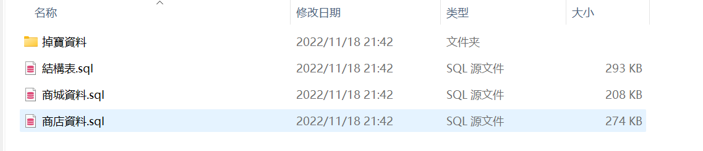
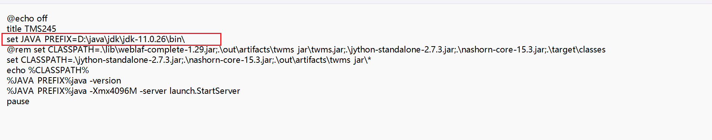
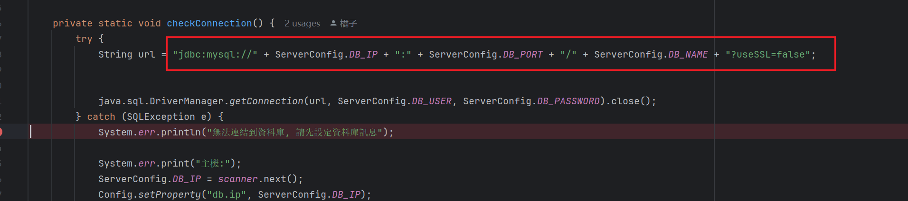
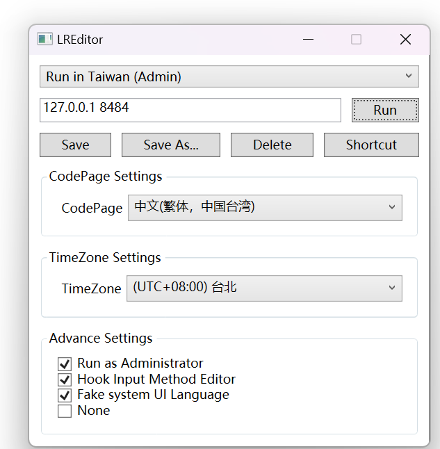
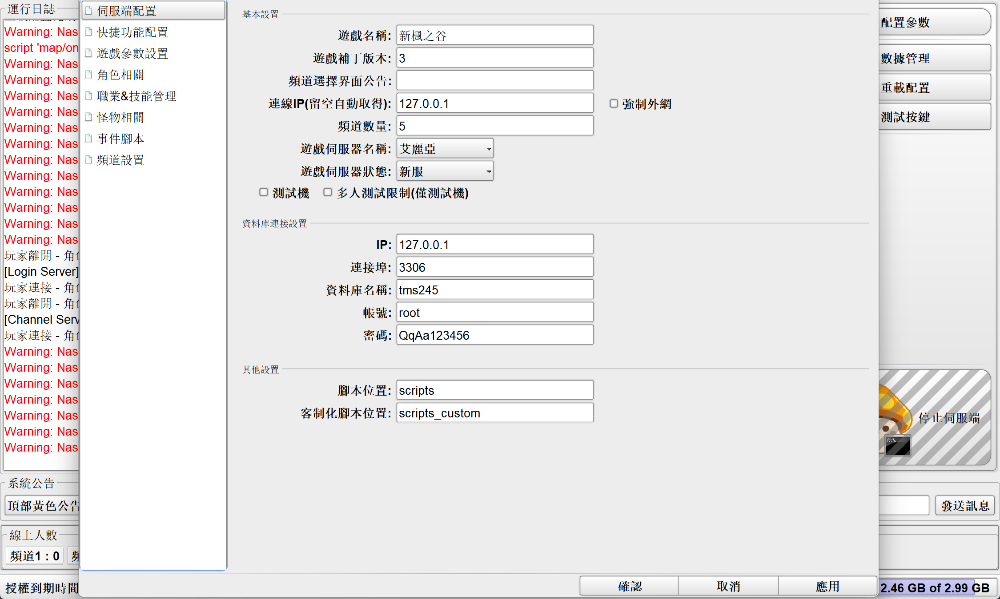
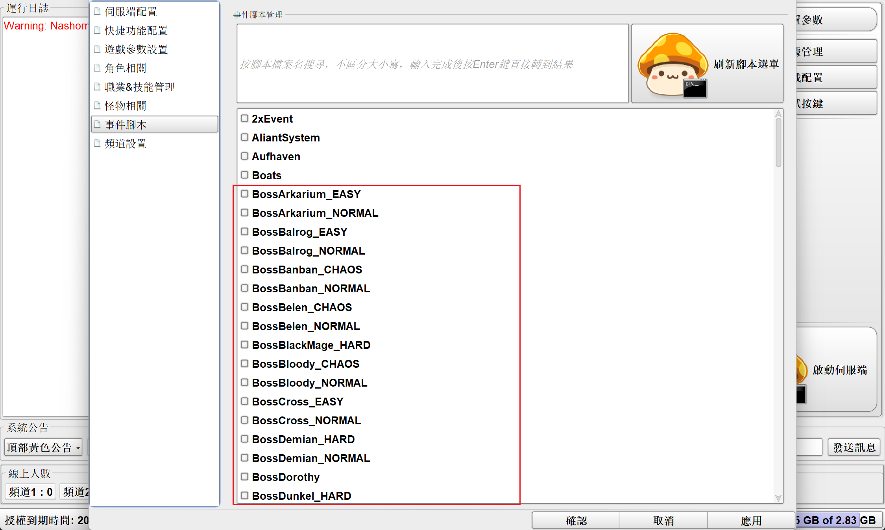

非常感恩作者！目前看到修复的比较好的一个端，部署非常简单解压客户端，一键启动服务端即可。不只是一个简单的端，看得出作者修复的很好，很多东西可以学习。
 
流程：
1. 下载：客户端+服务端：https://t.me/tms245
2. 解压客户端和服务端
3. 安装数据库，导入SQL文件

4. 启动服务端
JDK版本是11， mysql用57版本，

默认的JAR配置会报错，修改了checkDB的逻辑,拼接成完整的jdbc

5. 启动客户端
>需要改成繁体环境，或者向我一样模拟繁体环境登陆。

6. 开始玩耍

几个注意事项：
1. Mysql 57数据库
默认配置：
ip:127.0.0.1
port:3306
db:playms
user: root
password: 123456

2. JDK版本为：11
3. 模拟湾湾地区登陆工具：
   https://github.com/InWILL/Locale_Remulator?tab=readme-ov-file#english--%E7%AE%80%E4%BD%93%E4%B8%AD%E6%96%87-1
   如下配置：即可在简体环境登陆。
   

4. 任务管理器 手动杀掉AES检查.等一分钟可能也行 
5. 開啓管理
在config/settings.properties文件下修改：
> gui.enabled=true

這裏有很多選項可以控制

6. BOSS攻略
需要開啓BOSS事件才可以進行攻略
   

7. 客戶端有帶245IDB，可以用來學習研究

## 修复
2025-06-26
数据库少一个字段导致导入不了商城商品
> ALTER TABLE `cashshop_modified_items` add COLUMN `extra_flags` tinyint(1)
然后看补丁说需要删除这个字段

2025-11-04
修復啓動會導致并發修改異常，修復SQL文件